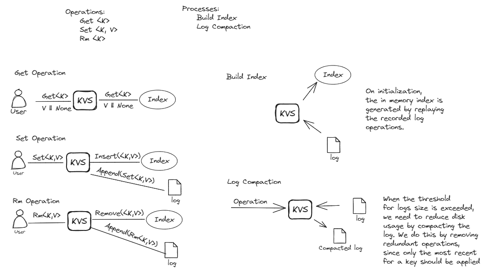

# PingCAP Talent Plan Project - Practical Networked Applications in Rust

This repo contains the implementation for the Practical Networked Application in Rust, which is building a key-value database in Rust.

## Structure

Each section of the project has its own readme, which for now is copied manually to the `projects` directory. Each project builds on the previous, so the code will contain to change, but tags (or branches) will be created to checkpoint each solution state. The tests for each section of the project will also be kept in a corresponding test file in the `tests` directory.

## Design

